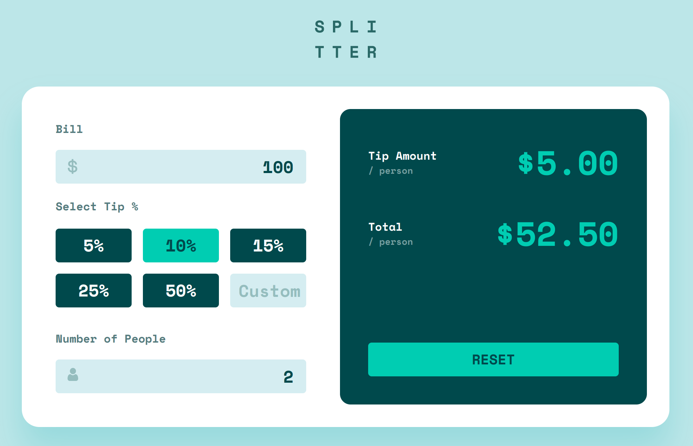

# Frontend Mentor - Tip calculator app solution

This is a solution to the [Tip calculator app challenge on Frontend Mentor](https://www.frontendmentor.io/challenges/tip-calculator-app-ugJNGbJUX). Frontend Mentor challenges help you improve your coding skills by building realistic projects.

## Table of contents

- [Overview](#overview)
  - [The challenge](#the-challenge)
  - [Screenshot](#screenshot)
  - [Links](#links)
- [My process](#my-process)
  - [Built with](#built-with)
  - [Useful resources](#useful-resources)
- [Author](#author)

## Overview

### The challenge

Tip calculator app with React.js and Styled Components...

### Screenshot

### Links

- Solution URL: [GitHub](https://github.com/Giorgi-Jalali/tip-calculator-app-react/tree/master)
- Live Site URL: [GitHub Pages](http://giorgi-jalali.github.io/tip-calculator-app-react)

## My process

### Built with

- [React](https://reactjs.org/) - JS library
- [Styled Components](https://styled-components.com/) - For styles

### Useful resources

- [Beta.Reactjs.org](https://beta.reactjs.org/learn)

## Author

- LinkedIn - [Giorgi Jalali](https://www.linkedin.com/in/giorgi-jalali-0336b8225/)
